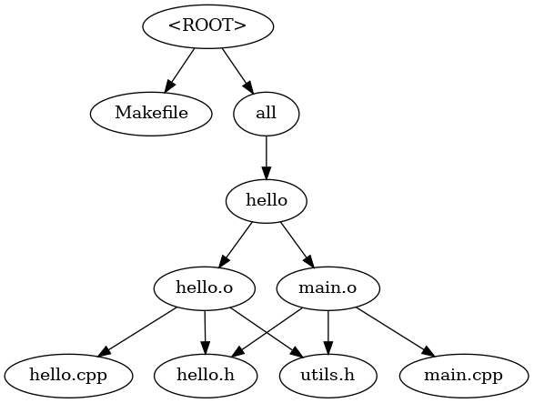

# Dependency Graph Creation from Make

GNU Makefiles are written in a Turing-complete interpreted language, making their parsing quite complex. Handling macros, substitutions, pattern rules with multiple expansion phases, and conditional recursive inclusions directly from Makefiles can be highly challenging. Therefore, parsing Makefile directly is not recommended. A more efficient approach is to parse the debug output generated by `make`.

You can invoke the script in two ways:

1. Redirecting `make` output to a log file:

    `make -Bnd > make.log`

    `graph.py make.log`

2. Piping `make` output directly to the script:

    `make -Bnd | graph.py`

Example graph for [this](test_3/Makefile) Makefile.

